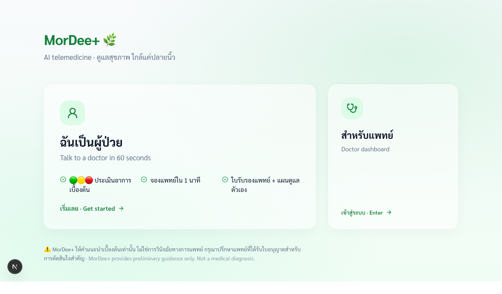
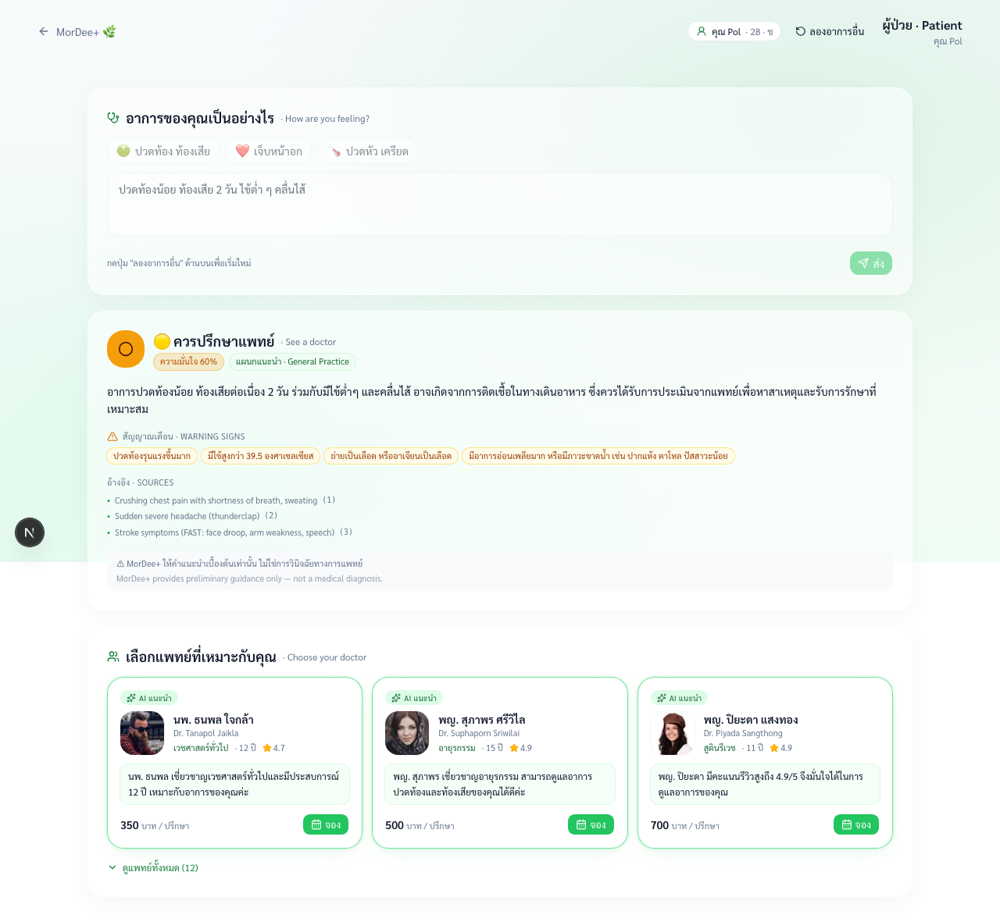
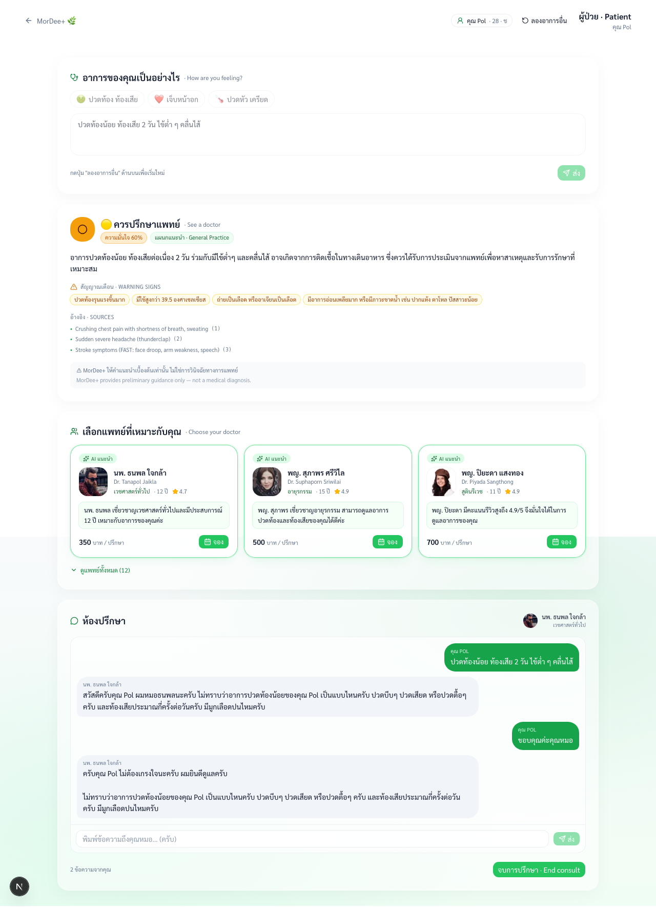
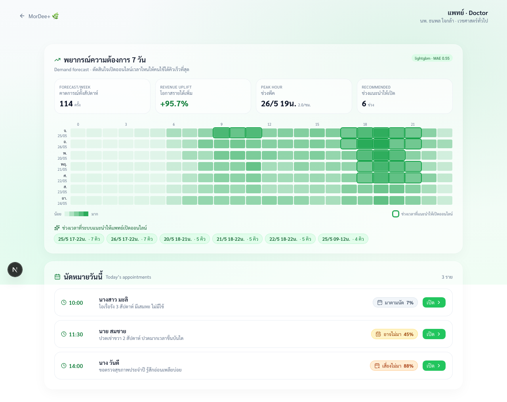
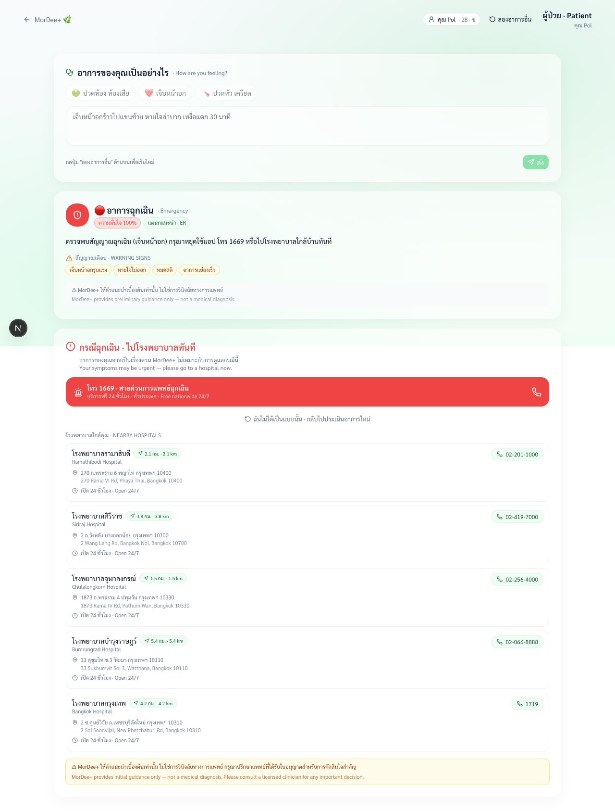
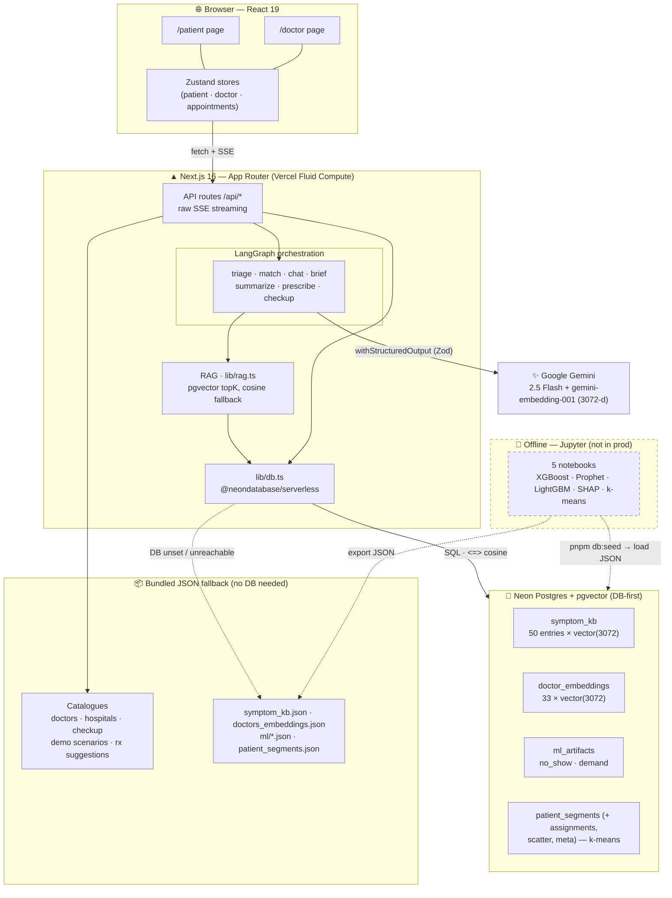
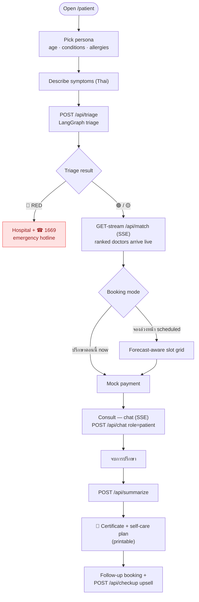
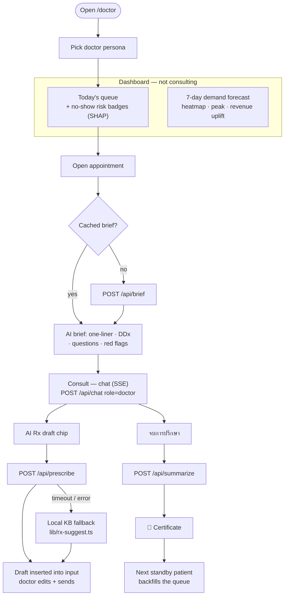
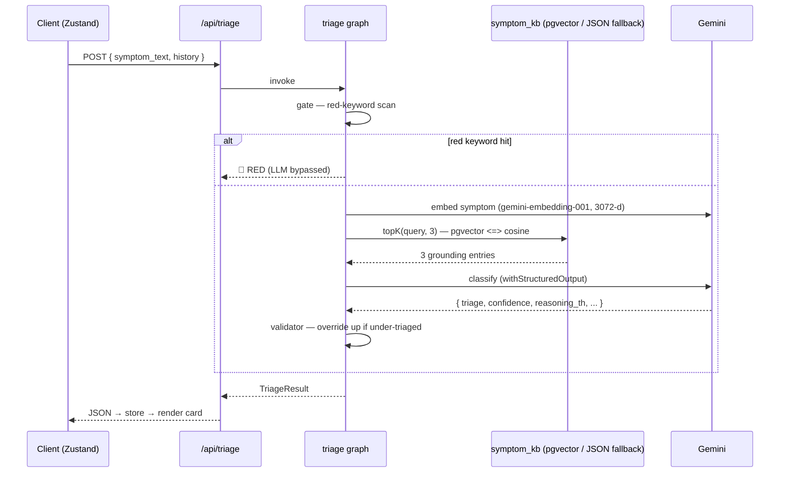
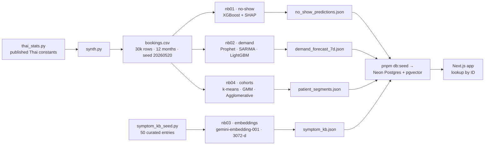

<div align="center">

# MorDee+ 🌿

### AI-assisted Thai telemedicine — patient triage on one side, an ML-powered doctor dashboard on the other.

[](https://nextjs.org)
[](https://react.dev)
[](https://www.typescriptlang.org)
[](https://tailwindcss.com)
[](https://ai.google.dev)
[](https://langchain-ai.github.io/langgraph/)
[](https://neon.tech)
[](https://www.python.org)

**Live demo → [mordee-x.vercel.app](https://mordee-x.vercel.app)**

*ดูแลสุขภาพ ใกล้แค่ปลายนิ้ว — healthcare at your fingertips.*

<br/>



</div>

> **About this build.** MorDee+ is a polished, fully working demo of a Thai telemedicine product. It was produced as an academic project for two MADT courses (presented 2026‑05‑30). Everything below describes it as the product it models — the only "demo-isms" are deliberate choices (ML trained offline; a managed **Neon Postgres** backend that **automatically falls back to bundled JSON** so the demo can never break) explained in [Architecture](#-architecture).

---

## Table of Contents

- [The problem & the business case](#-the-problem--the-business-case)
- [What it does](#-what-it-does)
- [Screenshots](#-screenshots)
- [Architecture](#-architecture)
- [Application flow](#-application-flow)
- [The AI layer — LLM + RAG](#-the-ai-layer--llm--rag)
- [The ML layer — notebooks](#-the-ml-layer--notebooks)
- [Tech stack](#-tech-stack)
- [Design system](#-design-system)
- [Project structure](#-project-structure)
- [Getting started](#-getting-started)
- [State & persistence](#-state--persistence)
- [Deployment](#-deployment)
- [Disclaimer](#-disclaimer)

---

## 🩺 The problem & the business case

Thailand's telemedicine market grew up fast during and after COVID, but it carries three structural drags that MorDee+ is built to attack:

| Problem | What the data says | How MorDee+ responds |
| --- | --- | --- |
| **Wrong front door** — patients can't tell "rest at home" from "go to the ER now," so emergencies queue for a video call while trivial cases clog doctors. | Thai ED triage skews ~2% red / 30% yellow / 68% green. | **AI triage (คัดกรอง)** classifies every complaint 🟢🟡🔴 in seconds. Red cases are routed *straight to the 1669 emergency line and nearby hospitals* — never into a booking queue. |
| **No-shows** burn doctor time and revenue. | Telemedicine no-show base rate ≈ **14%** (AJPM 2024), worse for first-time-app users. | A **no-show risk model (XGBoost + SHAP)** scores every appointment and recommends a reminder cadence (SMS → SMS+call → require confirmation). |
| **Idle hours** — doctors sit empty at 3pm and turn patients away at 8pm. | Demand peaks 19:00–21:00 and Mon–Tue, troughs overnight and on holidays. | A **per-specialty demand forecast (Prophet / SARIMA / LightGBM)** shows a 7‑day heatmap and recommends which online slots to open — quantified as an expected revenue uplift. |

**The users skew older and female.** Published Thai telemedicine stats (Liebert TMR 2024, SAGE UCS 2024) show ~66% female users and ~70% aged 40+, concentrated in Bangkok. That shaped a Thai‑first, large‑type, low‑friction UI rather than a Gen‑Z chat aesthetic.

**Two-sided value.** The patient side removes friction and anxiety (triage → match → book → consult → certificate in one scroll). The doctor side is an operations and revenue tool (queue + risk + forecast + AI scribe). The same booking event log feeds both the ML models and the live UI.

---

## ✨ What it does

### Patient side — `/patient`
1. **Pick a persona** (working adult, young patient with allergies, child) — preloads age, conditions, allergies so triage is personalised.
2. **Describe symptoms** in free-text Thai (or tap a quick-symptom chip).
3. **AI triage** returns 🟢 self-care / 🟡 see a doctor / 🔴 emergency — with confidence, plain-Thai reasoning, warning signs, and a recommended specialty, grounded in a clinical knowledge base.
4. **Doctor matching** streams in ranked doctors (semantic fit + rating), each with a one-line "why this doctor" reason.
5. **Book** — *ปรึกษาตอนนี้* (now) or *จองล่วงหน้า* (schedule from forecast-aware slots) → mock payment.
6. **Consult** — a streaming chat with the matched doctor.
7. **Summary** — an auto-generated **medical certificate (ใบรับรองแพทย์)** and **self-care plan (แผนดูแลตัวเอง)**, both printable; plus a follow-up suggestion and a relevant **health check-up package** upsell.
8. **🔴 red path** short-circuits all of the above to the **1669 hotline** + nearby hospitals.

### Doctor side — `/doctor`
1. **Pick a doctor persona** (GP, cardiologist, …) — drives specialty-specific data.
2. **Today's queue** with a **no-show risk badge** per appointment (LOW / MED / HIGH, with the top SHAP factors and a recommended action in a popover).
3. **7-day demand forecast** — an interactive heatmap, "demand now" gauge, peak window, expected revenue uplift, and recommended slots to open.
4. **Patient cohorts** — a **k-means segmentation** card: the patient base split into 4 cohorts (pie composition + a PCA scatter showing cluster separation), a model-comparison table (KMeans vs Agglomerative vs GMM), and a recommended retention action per cohort.
5. **Consult takeover** — a pre-consult **AI brief**: one-liner, key symptoms, ranked differential diagnosis (DDx), suggested questions, and red flags, grounded in the same KB.
6. **AI Rx draft** — one click drafts a prescription (medications, dose, advice, follow-up) for the doctor to review and edit — never auto-issued.
7. **End consult** → the same certificate + self-care summary, and the next standby patient backfills the queue.

---

## 📸 Screenshots

<table>
<tr>
<td width="50%"></td>
<td width="50%"></td>
</tr>
<tr>
<td align="center"><b>Patient · AI triage 🟡 + ranked doctor matches</b></td>
<td align="center"><b>Patient · streaming consult</b></td>
</tr>
<tr>
<td width="50%"></td>
<td width="50%"></td>
</tr>
<tr>
<td align="center"><b>Doctor · demand forecast + no-show risk queue</b></td>
<td align="center"><b>🔴 Red path · 1669 hotline + nearby hospitals</b></td>
</tr>
</table>

> All captured at the live demo — [mordee-x.vercel.app](https://mordee-x.vercel.app).

---

## 🏗 Architecture

MorDee+ is **one Next.js 16 App Router app**. The browser talks to Next.js **API routes**, which run **LangGraph** graphs against **Gemini**, grounded by **RAG over pgvector on a managed Neon Postgres** database. Postgres is the runtime source of truth for the ML outputs, the symptom knowledge base, doctor-matching embeddings, and the patient cohorts — and every query **falls back to bundled JSON** the moment the database is unset or unreachable. Catalogues (doctors, hospitals, …) ship as static JSON. There is no separate application backend.



### Constraints — and why they're deliberate

These are deliberate choices, made so the demo stays **deterministic, reproducible, and reviewable** — not because every pattern scales to a hospital.

- **DB-first, with automatic JSON fallback.** ML outputs, the symptom KB, doctor embeddings, and patient cohorts live in **Neon Postgres** (Vercel Marketplace, Free tier) with **pgvector**, accessed through `src/lib/db.ts` and seeded by `pnpm db:seed`. If `DATABASE_URL` / `POSTGRES_URL` is unset or the DB is unreachable, every lookup transparently falls back to the bundled JSON — so the demo runs fully offline and can't break in front of a grader.
- **No live ML in production.** Models are trained offline in Jupyter and exported to JSON, then loaded into Postgres; API routes look up predictions by scenario / specialty ID. No Python sidecar, no model server.
- **pgvector for RAG, in-memory cosine as the safety net.** Pre-embedded 3072-d vectors live in the `symptom_kb` table and are searched with pgvector's `<=>` cosine operator; `lib/rag.ts` falls back to a hand-written cosine over `data/symptom_kb.json` when the DB is unavailable. Both paths are crash-proof: the JSON KB loads lazily inside a `try/catch` (a corrupt file degrades to *no grounding*, never a 500), and `cosineSimilarity` guards dimension-mismatch and zero vectors so a bad embedding scores `0` instead of silently ranking on `NaN`.
- **No auth — but the paid routes aren't wide open.** Each role is a single route with no login (personas stand in for accounts), and there's no navigation between flows — everything else is a modal or a scroll. Because the demo is live at a public URL, a lightweight **per-IP rate limit** (`src/proxy.ts` — a 60 req/min sliding window that returns `429` at the cap) shields every `/api/*` route from someone looping a paid Gemini call to drain quota. It's in-memory (approximate on Fluid Compute); the production path is a Vercel Firewall rate rule.
- **Length caps on free-text input.** Symptom text (4 000 chars), chat messages (8 000), and names (120) are bounded with Zod `.max()` in `src/lib/llm/schemas.ts`, and the patient textarea mirrors the symptom cap — so an oversized paste is rejected with a `400` before it reaches the embedder or the LLM (an uncapped 1.5 MB body previously took ~20 s).
- **Write-state stays client-side.** Appointments and session state live in Zustand (+ `localStorage`) — never in the database.
- **Mock fallback.** Append `?mock=1` to any route to run the full demo deterministically without spending Gemini quota.

---

## 🔀 Application flow

### Patient journey



### Doctor flow



---

## 🤖 The AI layer — LLM + RAG

**Provider.** Google **Gemini 2.5 Flash** via `@langchain/google-genai`, orchestrated with **LangGraph**. Every route streams over **raw Server-Sent Events** (the streaming path is hand-rolled, not the Vercel AI SDK). All structured outputs are validated with **Zod** through `llm.withStructuredOutput(schema)`, and every call carries a 35-second timeout signal. System prompts live verbatim in `src/lib/llm/prompts.ts`.

### The seven graphs — `src/lib/llm/graphs/`

| Graph | Shape | Purpose | Output (Zod schema) |
| --- | --- | --- | --- |
| **triage** | 5-node `StateGraph` | Severity classification, KB-grounded | `gate → embed → retrieve → classify → validate` |
| **match** | async generator | Rank + stream doctors | hybrid score, one card per SSE frame |
| **chat** | `createReactAgent` + tools | Streaming consult (patient/doctor personas) | token + tool-call stream |
| **brief** | 2-node `StateGraph` | Pre-consult doctor brief | one-liner · DDx · questions · red flags |
| **summarize** | 1-node | Post-consult cert + self-care plan | diagnosis · ICD-10 · cert text · plan |
| **prescribe** | 1-node | Draft prescription for doctor review | medications · advice · follow-up |
| **checkup** | 3-node `StateGraph` | Recommend one check-up package | `embedQuery → retrieve → recommend` |

**Triage safety, by design.** Before the LLM runs, a **red-keyword gate** scans for hard emergencies (เจ็บหน้าอก, stroke signs, anaphylaxis, …) and can force a 🔴 verdict outright. After the LLM runs, a **validator** re-checks and overrides the model up to red if it under-triaged. The LLM can lower urgency only within safe bounds — it can never *downgrade* a red flag.

**Doctor matching** scores each doctor as `0.4 × specialty-fit + 0.4 × cosine(symptom, doctor-profile embedding) + 0.2 × normalised rating`, and streams each resolved card to the client as it's ready. The 33 doctor-profile embeddings (3072-d) are read from the `doctor_embeddings` table and cached in memory on the first match request (falling back to `data/doctors_embeddings.json`); if no embedding is available the score degrades gracefully to specialty + rating.

### RAG — `src/lib/rag.ts` + `src/lib/db.ts`

The 50-entry symptom KB carries **pre-computed 3072-dim `gemini-embedding-001` vectors** and lives in the `symptom_kb` pgvector table. At request time the query is embedded and `topK(query, 3)` runs a pgvector cosine search (`ORDER BY embedding <=> $query`, similarity reported as `1 − distance`) to ground both `triage` and `brief`. If the DB is unavailable, the same `topK` transparently falls back to a hand-written **cosine similarity** over the bundled `data/symptom_kb.json`. Each KB entry carries bilingual guidance, a severity, a specialty hint, and a real clinical source (e.g. Manchester Triage System, Thai ACS Guidelines 2020, WHO Dengue 2009).

### Prescription — three layers

1. **Live draft** — the `prescribe` graph reads triage, specialty, brief, DDx, and the recent transcript; 🔴 triage returns *no* meds + a referral message.
2. **Local fallback** — `src/lib/rx-suggest.ts` resolves a sensible draft from `src/data/rx_suggestions.json` by red-triage → keyword override → specialty → default, used on timeout or in `?mock=1`.
3. **Thai sentence builder** — `src/lib/prescription.ts` turns either source into a natural Thai sentence the doctor can paste and edit.

### API routes — `src/app/api/`

| Route | Method | Streams | Purpose |
| --- | --- | --- | --- |
| `/api/triage` | POST | – | Classify symptom severity (🟢🟡🔴) |
| `/api/match` | POST | ✅ SSE | Rank + stream matched doctors |
| `/api/chat` | POST | ✅ SSE | Streaming consult (patient or doctor role) |
| `/api/brief` | POST | – | Pre-consult doctor brief |
| `/api/summarize` | POST | – | Certificate + self-care plan |
| `/api/prescribe` | POST | – | Draft prescription |
| `/api/checkup` | POST | – | Recommend one check-up package |
| `/api/predict` | GET | – | Look up ML output: `?type=no_show\|demand\|segment` by ID, or `?type=segments` for the full patient-cohort model (DB-first, JSON fallback) |

> Every route honours `?mock=1` for an instant, deterministic, quota-free response.

### One request, end to end (triage)



---

## 📊 The ML layer — notebooks

ML lives entirely in **Jupyter**. Notebooks train on a synthetic event log and export JSON to `data/ml/` and `data/symptom_kb.json`; `pnpm db:seed` loads those into Neon Postgres, and the app consumes them by ID (DB-first, JSON fallback). Nothing trains at request time.



**Foundation — synthetic data calibrated to real Thai stats.** `notebooks/lib/thai_stats.py` encodes published figures (66% female, ~70% aged 40+, ~14% no-show base rate, peak hours 19:00–21:00, monsoon +15%, holidays −30%) and effect sizes as logit coefficients (SMS confirmation −0.85, paid-upfront −0.60, prior no-shows +0.55, …). `synth.py` then generates **30,000 bookings** over a 12-month window (reproducible seed `20260520`) where the ground-truth no-show probability is a sigmoid of those features.

| Notebook | Task | Models | Output |
| --- | --- | --- | --- |
| `00_generate_synthetic_data` | Build the event log | calibrated sampler | `data/synthetic/bookings.csv` |
| `01_no_show_full_pipeline` | Predict no-show + reminder policy | **XGBoost** (champion, ROC-AUC ≈ 0.80) vs LogReg, **SHAP** TreeExplainer | `data/ml/no_show_predictions.json` |
| `02_demand_forecast_full_pipeline` | Per-specialty hourly demand | **Prophet** vs **SARIMA** vs **LightGBM** bake-off, tiered by volume | `data/ml/demand_forecast_7d.json` |
| `03_seed_symptom_kb` | Clinical KB + embeddings | `gemini-embedding-001` (3072-d, L2-normalised) | `data/symptom_kb.json` |
| `04_patient_segmentation` | Patient cohorts | **k-means** champion vs **GMM** / **Agglomerative**, StandardScaler + PCA(2) | `data/ml/patient_segments.json` |

- **No-show (nb01)** — full pipeline (EDA → feature selection → tuning → calibration → SHAP → policy sim). Scores **each of the 18 demo appointments** (`NS001`–`NS018`, one per queue patient across the three doctor personas) through the trained model on that patient's *own* features, so every badge's `p_no_show`, `risk_tier`, top SHAP factors, and `recommended_action` reflect the patient on screen — not a recycled exemplar. Tiers span LOW/MED/HIGH and queues are no longer a tidy low→high ladder.
- **Demand (nb02)** — a 3-model bake-off across **18 specialties**, tiered (full bake-off for high-volume, LightGBM for mid, seasonal-naive for sparse), 14-day horizon. Exports `by_specialty` (hourly forecasts + recommended online slots + expected revenue uplift) plus a `DD01` back-compat alias.
- **Symptom KB (nb03)** — 50 hand-curated entries (≈15 red / 20 yellow / 15 green) with real clinical citations, anchored to the demo scenarios.
- **Patient cohorts (nb04)** — unsupervised segmentation of the patient base on 10 behavioural features (bookings, observed no-show rate, completion rate, SMS-confirm rate, lead time, age, triage mix, …). Picks `k` via elbow + silhouette, runs a 3-algorithm bake-off (**k-means** wins on silhouette / Davies-Bouldin / Calinski-Harabasz), projects to 2-D with **PCA**, and labels each cohort with a Thai persona + recommended retention action. Exports `meta` (model comparison, PCA variance), the **4 cohorts**, a 600-point PCA scatter, and per-scenario assignments. The 150 sampled real users carry **authentic** cluster assignments; the fictional demo personas (which have no lifetime booking history for the clustering) are placed via a representative profile keyed to their predicted no-show tier, so a persona's cohort chip stays consistent with its no-show badge. Surfaces in the doctor dashboard's **Patient cohorts** card and `GET /api/predict?type=segments`.

Regenerate with `uv run python notebooks/_build.py` then `uv run jupyter nbconvert --to notebook --execute --inplace notebooks/XX.ipynb`. Reload Postgres with `pnpm db:seed`.

---

## 🧱 Tech stack

| Layer | Tools |
| --- | --- |
| **Framework** | Next.js **16.2.6** (App Router) · React **19.2.4** · TypeScript **5** |
| **Styling** | Tailwind CSS **4** (CSS-first `@theme`) · shadcn/ui (add components with the **4.6.0** CLI) · lucide-react · **next-themes** (dark mode) |
| **Backend / data** | **Neon Postgres** (Vercel Marketplace, Free) + **pgvector** · `@neondatabase/serverless` **1.x** · DB-first with bundled-JSON fallback |
| **State** | Zustand **5** (3 stores) · `localStorage` persistence |
| **Motion / charts** | Framer Motion **12** · Recharts **3** |
| **AI** | `@google/genai` **2.x** · `@langchain/core` **1.x** · `@langchain/google-genai` **2.x** · `@langchain/langgraph` **1.x** · Zod **4** · react-markdown |
| **ML (Jupyter)** | Python **3.12** · pandas · numpy · scikit-learn · **XGBoost** · **LightGBM** · **Prophet** · statsmodels · **SHAP** · holidays · google-genai |
| **Tooling** | pnpm 11 · uv (Python) · Playwright (e2e) · ESLint 9 |

---

## 🎨 Design system

- **Surface.** Every panel is a `<GlassCard>` — frosted glass (`backdrop-filter: blur(20px) saturate(180%)`), `rounded-2xl`, over a mint/teal mesh background.
- **Colour.** Mint scale `mint-50 → mint-800` (brand primary `#22c55e`); triage semantics `triage-green | triage-yellow | triage-red`. No-show badges use a distinct slate/amber/orange ramp so they're never confused with triage colours.
- **Type.** **Sarabun** (Thai + Latin), Inter fallback. Thai-first, English peppered where natural (doctor English names, ICD-10, specialty hints) — **no i18n library, no locale switcher**.
- **Dark mode.** Light by default; a manual `<ThemeToggle>` (floating on the landing page, in the `RoleHeader` actions on each role page) flips themes via **`next-themes`** (class strategy, `enableSystem={false}` — no OS following). Wired in `globals.css` with `@custom-variant dark` + a `.dark {}` token block; the mint primary holds across themes while triage/chart hues brighten for contrast. Brand neutrals were migrated to semantic tokens (`text-foreground`, `bg-card`, `border-border`) so they auto-flip.
- **Print.** The certificate and self-care plan render into isolated `#cert-print-area` / `#care-print-area` regions for clean PDF export, and `@media print` forces a white (light) background regardless of theme.

---

## 🗂 Project structure

```
src/
├── app/
│   ├── page.tsx                 # landing — patient/doctor split hero + ThemeToggle
│   ├── patient/page.tsx         # patient flow (single route)
│   ├── doctor/page.tsx          # doctor dashboard (single route)
│   ├── layout.tsx · globals.css # Sarabun font · mint theme · glass · dark tokens
│   └── api/{triage,match,chat,brief,summarize,prescribe,checkup,predict}/
├── components/
│   ├── shared/   # GlassCard, RoleHeader, ChatStream, ConsultSummary, MedicalCertificate, ThemeProvider, ThemeToggle, …
│   ├── patient/  # SymptomChat, TriageResultCard, DoctorMatchList, BookingDialog, …
│   ├── doctor/   # AppointmentsCard, NoShowBadge, DemandForecastCard, PatientCohortsCard, ConsultPanel, PatientBrief, …
│   └── ui/        # shadcn primitives (Tabs, Dialog, Popover, Button, …)
├── lib/
│   ├── db.ts                    # Neon client · pgvector queries · JSON fallback
│   ├── llm/{client,prompts,schemas}.ts · llm/doctor-embeddings.ts
│   ├── llm/graphs/{triage,match,chat,brief,summarize,prescribe,checkup}.ts
│   ├── rag.ts · rx-suggest.ts · prescription.ts · mocks.ts
│   └── utils.ts
├── stores/{store-patient,store-doctor,store-appointments}.ts
└── data/
    ├── doctors.json (33) · hospitals.json (5) · checkup_programs.json (15)
    ├── demo_scenarios.json · rx_suggestions.json
    └── ml/{no_show_predictions,demand_forecast_7d,patient_segments}.json
scripts/
└── seed-neon.mjs                # pnpm db:seed — create tables + load JSON into Neon
data/
├── synthetic/bookings.csv       # 30k synthetic bookings
├── symptom_kb.json              # 50 entries × 3072-d embeddings
└── doctors_embeddings.json      # 33 doctor profiles × 3072-d (match fallback)
notebooks/
├── _build.py                    # programmatic .ipynb builder
├── 00_…  01_…  02_…  03_…  04_patient_segmentation.ipynb
└── lib/{thai_stats,synth,symptom_kb_seed,segmentation}.py
```

---

## 🚀 Getting started

### Prerequisites
- **Node 20+** and **pnpm 11** (`corepack enable`)
- A **Google Gemini API key** (free tier works) — [aistudio.google.com](https://aistudio.google.com/app/apikey)
- *(optional)* A **Neon Postgres** database (Vercel Marketplace, Free tier) for the pgvector backend — without it the app runs entirely on bundled JSON
- *(optional, notebooks only)* **uv** + Python 3.12

### Run the app

```bash
pnpm install

cp .env.local.example .env.local
# then edit .env.local:
#   GOOGLE_API_KEY=your_key_here
#   GEMINI_MODEL=gemini-2.5-flash
#   DATABASE_URL=postgres://…   # optional — Neon connection string
#                               # (POSTGRES_URL also accepted; omit to use JSON fallback)

pnpm dev          # → http://localhost:3000  (Turbopack)
```

Open **`/patient`** and **`/doctor`**. To explore without spending API quota, append **`?mock=1`** to any page (e.g. `/patient?mock=1`).

### Seed the database (optional)

Only needed if you want the pgvector backend. With a `DATABASE_URL` set, create the tables and load the ML / RAG / embedding JSON into Postgres:

```bash
pnpm db:seed      # → scripts/seed-neon.mjs (idempotent)
```

Skip this entirely and the app falls back to the bundled JSON, so every feature still works offline.

```bash
pnpm build        # production build — also the fastest way to type-check
pnpm lint         # ESLint
```

### Run / regenerate the notebooks (optional)

```bash
uv sync
uv run python notebooks/_build.py            # rebuild .ipynb from source
uv run jupyter nbconvert --to notebook --execute --inplace notebooks/01_no_show_full_pipeline.ipynb
```

> 🔐 Secrets live only in `.env.local` (gitignored). Never commit real keys — the repo tracks `.env.local.example` as a template only.

---

## 🧠 State & persistence

Postgres holds only **read-only** data (ML outputs, the symptom KB, embeddings, cohorts). All **write-state** — personas, the appointment queue, consult sessions — is client-side Zustand (+ `localStorage`); there is no backend session.

| Store | Owns |
| --- | --- |
| `store-patient.ts` | persona · symptom → triage → match → booking → consult → summary → checkup |
| `store-doctor.ts` | doctor persona · appointment queue · live brief · Rx draft · summary (with three independent abort signals so the brief, chat, and Rx fetches never cancel each other) |
| `store-appointments.ts` | a shared follow-up ledger (`localStorage`) visible to both roles |

---

## ☁️ Deployment

Deployed on **Vercel** (project `mordee-x`). `pnpm build` produces the production bundle; set `GOOGLE_API_KEY` and `GEMINI_MODEL` as environment variables in the Vercel dashboard. The pgvector backend is a **Neon Postgres** integration from the Vercel Marketplace — it injects `DATABASE_URL` / `POSTGRES_URL` automatically; run `pnpm db:seed` once after provisioning to populate it (and omit it entirely to ship on the JSON fallback). Live at **[mordee-x.vercel.app](https://mordee-x.vercel.app)**.

---

## ⚠️ Disclaimer

MorDee+ provides **preliminary guidance only — it is not a medical diagnosis.** AI triage, briefs, and prescription drafts are decision *support* for a licensed clinician and are never auto-issued. Synthetic data and ML outputs are calibrated to published statistics for demonstration and are not derived from real patient records.

<div align="center">

*สร้างด้วยใจ 🌿 — built as an academic demo for MADT, MorDee+ team.*

</div>
